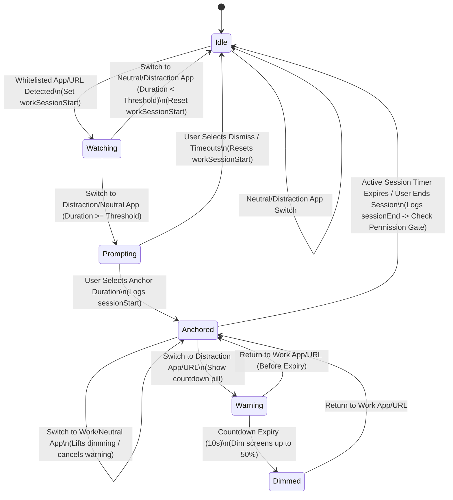

# ⚓ Agentic Development Architecture (AGENTS.md)

This file details the design patterns, architectural state flow, and system relationships for AI agents contributing to the Anchored project.

---

## 📂 Codebase Directory Overview

```
Anchored/
├── App/                # App delegate, lifecycle, main entry, and SwiftUI views
├── Audio/              # Haptic / sound feedback (AudioEngine)
├── Engine/             # Core state engine, monitors, and matching heuristics
│   ├── ActivityMonitor.swift
│   ├── AppSwitchMonitor.swift
│   ├── BrowserStrategies.swift
│   ├── FocusEngine.swift
│   ├── ProfileManager.swift
│   ├── ShadowTrackingEngine.swift
│   ├── SmartNudgeManager.swift
│   └── URLMatcher.swift
├── MenuBar/            # macOS Menu bar status items and context settings
├── Models/             # ActiveSession, AppContext, SessionEvent, SessionState, WorkProfile
├── Onboarding/         # Educational steps and initial setups
├── Overlay/            # ExitTrigger, CountdownPill, and DimOverlay panels
└── Storage/            # Preferences, database logging (SQLiteSessionStore)
```

---

## 🔄 FocusEngine State Transitions

The core focus tracking state machine resolves state changes in a strict flow:



### 🔓 The Permission Gate Lifecycle
To ensure zero upfront friction:
1. The application initializes with browser URL monitoring locked.
2. The user works and completes sessions. Each finished session logs a `sessionEnd` event.
3. At the end of every session, `FocusEngine` checks if the database contains **10 or more** `sessionEnd` events and if accessibility permissions are not yet trusted.
4. If the conditions are met, `FocusEngine` notifies the delegate, opening the spring-animated `PermissionGatePanel` to prompt for Accessibility permissions.
5. Once granted (`AXIsProcessTrusted() == true`), `AppSwitchMonitor` automatically starts its 2.5-second polling timer whenever a browser is in the foreground, enabling context-aware domain monitoring.
