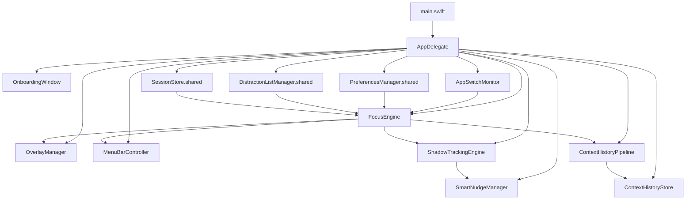
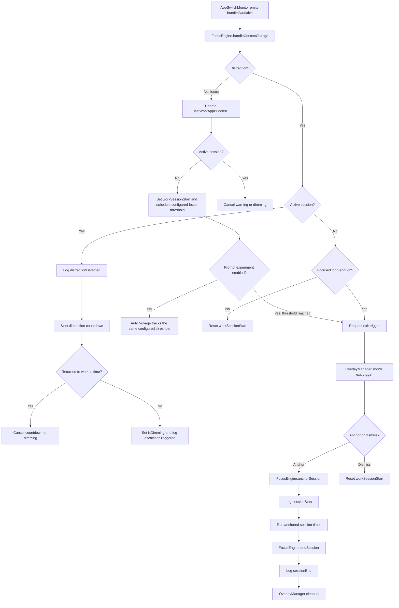

# Anchored Architecture

## Purpose

This document is the fast path for future agents and engineers. Read it before exploring the repo when you need to understand:

- how the app is composed at runtime
- where focus tracking logic lives
- where persistence and analytics live
- which invariants must not be broken
- where V2.6 is expected to land

It is intentionally opinionated and file-oriented so you do not need to search the entire repository to find the relevant seams.

## Current State Snapshot

- Product: macOS menu-bar focus app
- Language/runtime: Swift 5.7, AppKit + SwiftUI, macOS 13
- Project generation: XcodeGen via `project.yml`
- Persistence: GRDB over SQLite, with legacy JSON migration in `SessionStore`
- Main composition root: `Anchored/App/AppDelegate.swift`
- Core runtime loop: `AppSwitchMonitor -> FocusEngine -> OverlayManager/MenuBarController/SessionStore`
- Current context model: `bundleID + optional URL + title`, surfaced as `AppContext`
- Work profiles now persist per-profile `allowedApps` alongside distraction apps and domains
- Focus classification uses profile `allowedApps`/domains for native apps and explicit browser rules, with a local browser-content heuristic suppressing known gaming and entertainment contexts, smart AI classification layers (`SmartAppClassifier` and `SmartWebClassifier`) dynamically classifying unregistered productive IDEs/apps and web coding forums/tutorials, and an on-device visual AI classification layer (`SmartImageClassifier` utilizing macOS native Vision framework or a local Apple Silicon MLX vision-language model like `SmolVLM-256M-Instruct-4bit`) to inspect the active window's visual layout and prevent false alarms.
- The application includes privacy controls to toggle the AI Visual Productivity Check (`PreferencesManager.enableImageClassification`) and choose/download the local MLX VLM model (`useLocalGemma` and `downloadGemmaModel()`) during onboarding and in settings.
- The application dynamically updates its `NSApplication` activation policy: it runs as a background-only accessory app (no Dock or Cmd+Tab app switcher icon) by default, but elevates to a regular application (showing the Dock/Cmd+Tab icon) when onboarding, settings, or focus session windows are open.
- The onboarding focus threshold and distraction countdown remain separate: focus threshold controls session establishment, while countdown duration controls fog/dimming after distraction
- Auto Voyage now runs continuously in the normal runtime: `ShadowTrackingEngine` watches focus context on device, and `SmartNudgeManager` only adds an optional local notification when auto-focus starts
- Context history now persists sanitized observations into a dedicated `context_observations` table through `ContextHistoryPipeline` and `ContextHistoryStore`
- `PreferencesManager.selectedThemeID` drives the active palette, with the default `baldr` theme now presented as the warm walnut, brass, and parchment `Heritage` palette
- `ThemePalette` is the shared chrome layer for appearance, with semantic canvas/surface/border/text roles now derived from each theme's own colors and contrast-aware text colors, and `PirateTheme` resolves dynamically from the selected palette so accents, backgrounds, layout surfaces, onboarding, overlays, custom windows, popovers, and dashboard chrome inherit the active theme
- The entire user-facing app is now unified under the dark warm control-room aesthetic with glowing background overlays, matching the dashboard, and the user-facing Appearance chooser has been removed from Settings
- Major architectural pressure in V2.6: make context collection reliable, async-safe, privacy-aware, and easier to test
- Storage now has a versioned GRDB migration path, URL/title sanitization, and opt-in history retention helpers in support of V2.6
- Dashboard analytics exposes typed async query contracts and generation-checked chart load states for Captain's Log, with month-to-date ranges anchored to the first session in the month and an all-time summary card below the scroll fold
- `MenuBarController` routes Captain's Log into `SettingsWindow`; `SettingsView.swift` embeds `DashboardView.swift` without its standalone sidebar so analytics, profiles, focus apps, and preferences share one window
- The settings sidebar no longer exposes separate Stats/Hourglass or Analytics/Voyage Logs destinations; Captain's Log is the single analytics surface
- `Anchored/App/Views/ControlRoomSurface.swift` now holds the reusable control-room shell/card/footer primitives, and `DashboardView.swift` is the first surface to consume them
- The new Accessibility provider and sanitizer seams exist, and the history pipeline is already wired from `AppDelegate`, but the live monitor still emits legacy tuples instead of `ContextSnapshot`

## Repo Map

### Product code

- `Anchored/App/`
  - Process entry and app composition.
  - `main.swift` starts `NSApplication`.
  - `AppDelegate.swift` wires the monitor, engine, overlay manager, menu bar, onboarding, and smart nudge pipeline.
- `Anchored/App/Views/`
  - `DashboardView.swift` composes the dashboard shell and cards.
  - `ControlRoomSurface.swift` provides the shared background/card/footer primitives for the new control-room visual language.
- `Anchored/MenuBar/`
  - Status item, popover/menu behavior, settings window, dashboard window, start-session window.
- `Anchored/Engine/`
  - Focus tracking, app/browser context collection, history pipeline, profile logic, nudges, URL matching.
- `Anchored/Models/`
  - Session, event, state, context, dashboard, persistence, profile, and theme value types.
- `Anchored/Storage/`
  - Preferences, focus/distraction lists, GRDB store, history store, migrations, dashboard queries.
- `Anchored/Overlay/`
  - Exit trigger, countdown pill, permission gate, dimming overlays.
- `Anchored/Onboarding/`
  - First-run flow and profile/preferences onboarding UI.
- `Anchored/Audio/`
  - Sound feedback for overlay/session interactions.

### Tests

- `AnchoredTests/Engine/` covers engine state, browser parsing, URL matching, smart-nudge-adjacent logic.
- `AnchoredTests/Storage/` covers SQLite/queries/preferences/list managers.
- `AnchoredTests/Models/` covers value types and event encoding.
- `AnchoredTests/Overlay/` and `AnchoredTests/Audio/` cover UI coordinators and sound behavior.

## Runtime Composition

### Composition root

`Anchored/App/AppDelegate.swift` is the real architecture hub today.

It currently:

1. Checks `hasCompletedOnboarding` in `UserDefaults` and shows onboarding only on first launch or after a reset.
2. On completion, instantiates:
   - `AppSwitchMonitor`
   - `FocusEngine`
   - `OverlayManager`
   - `MenuBarController`
   - `ShadowTrackingEngine`
   - `SmartNudgeManager`
   - `ContextHistoryStore`
   - `ContextHistoryPipeline`
3. Wires `ShadowTrackingEngine` and `SmartNudgeManager` into the live focus runtime; auto-focus tracking is always active, while smart nudges only gate the optional notification.
4. Subscribes to `PreferencesManager.shared` so focus and fog threshold changes mutate the live runtime.
5. Starts the `FocusEngine`, which starts the activity monitor.
6. Keeps the history store disabled until the privacy/settings flow enables collection.

This means runtime composition is still centralized, singleton-heavy, and AppDelegate-driven.

### Composition diagram



### Primary runtime flow

```text
NSWorkspace activation / polling
  -> AppSwitchMonitor
  -> FocusEngine.handleContextChange(...)
  -> state/event decisions
  -> SessionStore / NotificationCenter / FocusEngineDelegate
  -> OverlayManager + MenuBarController + ShadowTrackingEngine observers
```

### Secondary runtime flow

```text
PreferencesManager/ProfileManager/list managers
  -> NotificationCenter or Combine updates
  -> FocusEngine/MenuBarController/ShadowTrackingEngine react
```

### Session and enforcement flow



## Core Modules

### Focus tracking and enforcement

#### `Anchored/Engine/FocusEngine.swift`

This is the central behavioral engine.

Responsibilities:

- stores current app, URL, title, and `AppContext`
- tracks `idle`, `watching`, and `anchored` session states
- decides whether a context is focus, distraction, or neutral
- creates `sessionStart`, `distractionDetected`, `escalationTriggered`, and `sessionEnd` events
- drives exit-trigger prompts, distraction countdowns, and dimming state
- posts `focusEngineStateDidChange` and `focusEngineContextDidChange`
- continues to publish legacy `bundleID`/URL/title context updates for downstream consumers during the V2.6 transition

Important inputs:

- `ActivityMonitor` implementation, currently `AppSwitchMonitor`
- `ProfileManager.activeProfile`
- `ProfileManager.activeProfile.allowedApps` as the per-profile positive app set
- `SessionStore`
- `PreferencesManager` updates via `AppDelegate`
- `ShadowTrackingEngine` as the always-on on-device auto-focus companion

Important outputs:

- `FocusEngineDelegate` callbacks to `OverlayManager`
- session events written to storage
- notifications consumed by menu bar and smart nudge systems
- legacy context-change notifications consumed by the history pipeline and existing observers

State invariants:

- `activeSession != nil` implies `state == .anchored`
- `workSessionStart != nil && activeSession == nil` implies `state == .watching`
- distraction countdown and dimming only matter during anchored sessions
- `lastWorkAppBundleID` is the last recognized focus context and is reused for later logging/UI
- `currentContext` still represents the latest raw runtime tuple, while `PersistedContextObservation` stores the sanitized history copy

Files to read for engine changes:

- `Anchored/Engine/FocusEngine.swift`
- `Anchored/Engine/ShadowTrackingEngine.swift`
- `Anchored/Engine/SmartNudgeManager.swift`
- `AnchoredTests/Engine/FocusEngineTests.swift`
- `Anchored/Models/SessionState.swift`
- `Anchored/Models/ActiveSession.swift`
- `Anchored/Models/SessionEvent.swift`

### Context collection

#### `Anchored/Engine/AppSwitchMonitor.swift`

Current role:

- observes `NSWorkspace.didActivateApplicationNotification`
- identifies the frontmost app bundle ID
- polls supported browsers every 2.5 seconds
- emits `bundleID`, optional URL, and title through `onContextChange`
- falls back to Accessibility window-title reads for native apps

Current constraints:

- browser polling is timer-based and main-run-loop-centric
- browser strategy calls are synchronous
- Safari/Chromium use AppleScript
- Firefox uses Accessibility traversal
- non-browser apps only provide title, not URL
- this monitor still owns the raw runtime tuple; the history pipeline listens to `FocusEngine` instead of replacing it yet

This file is one of the main V2.6 refactor targets.

#### `Anchored/Engine/BrowserStrategies.swift`

Contains:

- `AppleScriptExecutor` and `NSAppleScriptExecutor`
- `ChromiumBrowserStrategy`
- `SafariBrowserStrategy`
- `FirefoxBrowserStrategy`
- `BrowserStrategyFactory`

Current architectural observations:

- browser context retrieval is synchronous
- failure mostly collapses to `nil`
- Safari has a special-case warning path for disabled JavaScript Apple Events
- Firefox URL discovery walks the accessibility tree directly in the strategy

New helper seams that support the V2.6 provider work:

- `Anchored/Engine/AccessibilityValue.swift`
- `Anchored/Engine/AccessibilityContextProvider.swift`
- `Anchored/Engine/ContextHistoryPipeline.swift`
- `Anchored/Storage/ContextHistoryStore.swift`
- `Anchored/Models/PersistedContextObservation.swift`
- `Anchored/Models/DashboardModels.swift`

V2.6 intends to split this into a more explicit async collection pipeline with typed errors, stale-result rejection, and safer Accessibility helpers.

#### `Anchored/Engine/ContextSanitizer.swift`

Pure sanitizer for persisted titles and HTTP(S) URLs.

Responsibilities:

- collapses whitespace and control noise in persisted titles without lowercasing
- caps persisted titles at 512 grapheme clusters
- strips credentials, query, and fragment from persisted URLs
- rejects unsupported schemes rather than partially sanitizing them

#### `Anchored/Storage/DatabaseMigrations.swift`

Versioned GRDB migration plan used by `SQLiteSessionStore`.

Responsibilities:

- creates the `sessions` schema and indexes when absent
- creates the `context_observations` table and its timestamp index
- sanitizes legacy `sessions.url` values in place
- keeps migration behavior idempotent

### Persistence and analytics

#### `Anchored/Storage/SessionStore.swift`

This is a facade, not the real query layer.

Responsibilities:

- owns migration from legacy `sessions.json`
- forwards writes/reads to `SQLiteSessionStore`
- preserves the convenience `log` API while allowing callers and tests to observe write completion
- computes basic stats via in-memory event reads
- sanitizes persisted session URLs before they reach SQLite

Architectural note:

- the class name suggests the main store, but durable storage is really in `SQLiteSessionStore`
- some analytics live here, some live in `DashboardQueries.swift`

#### `Anchored/Storage/SQLiteSessionStore.swift`

This is the real persistence boundary.

Responsibilities:

- owns the GRDB `DatabaseQueue`
- applies the versioned migration plan from `DatabaseMigrations.swift`
- creates/migrates the `sessions` table and `context_observations` table
- writes session events on a utility queue
- reports async write success or failure through an optional main-queue completion callback
- preserves the original database file on migration failure and records the error in `migrationError`
- exposes raw event reads and recent session reads
- exposes direct helpers for `context_observations` count, oldest date, pruning, clearing, and latest identity lookup

Current schema:

- `sessions`
  - `id`
  - `timestamp`
  - `type`
  - `appBundleID`
  - `appName`
  - `url`
  - `focusDurationSeconds`
  - `sessionDurationSeconds`
  - `distractionAppBundleID`
  - `distraction_domain`
  - `action`
  - `category`
  - `sessionGoal`

SQL ownership invariant from repo guidance:

- keep SQL in `SQLiteSessionStore.swift` or `DashboardQueries.swift`

#### `Anchored/Storage/DashboardQueries.swift`

Analytics/query extension layer on top of `SQLiteSessionStore`.

Responsibilities:

- total focus time
- daily timeline reconstruction
- top distractions
- streak computation
- app name lookup and chart-friendly query helpers
- `DashboardQuerying` async completion-based reads that return typed bucket and distribution models on the main queue
- synchronous tuple/dictionary helpers that remain as wrappers for legacy callers and tests

This file reconstructs user-facing analytics from event streams rather than storing denormalized summaries.

#### `Anchored/Storage/ContextHistoryStore.swift`

Dedicated store facade for privacy-reviewed context observations.

Responsibilities:

- accepts raw context tuples from the live monitor path
- sanitizes and deduplicates consecutive identical observations before persistence
- keeps history writes off the main thread and calls completions back on the main queue
- supports count, oldest-date, prune, and clear operations for privacy/history settings

#### `Anchored/Engine/ContextHistoryPipeline.swift`

Bridge from `FocusEngine` context-change notifications into the history store.

Responsibilities:

- listens for `.focusEngineContextDidChange`
- converts the current focus context into a persisted observation
- maps browser bundle IDs to source labels for history rows
- keeps the history seam off until the store is explicitly enabled

### Preferences and classification inputs

#### `Anchored/Storage/PreferencesManager.swift`

Owns:

- countdown duration
- focus threshold
- launch at login
- smart nudges enablement
- hidden focus-prompt experiment rollout state
- selected settings theme
- AI Visual Productivity Check (`enableImageClassification`)
- SmolVLM 256M VLM model toggle (`useLocalGemma`) and download status (`gemmaDownloadStatus`)

Architecture notes:

- `@Published` state is live-wired into the engine from `AppDelegate`
- launch-at-login behavior is abstracted behind `LoginItemService` for tests
- theme selection persists through `UserDefaults` and resolves through `ThemeCatalog`
- a hidden `focusThresholdOverride` defaults key can temporarily shorten the live engine threshold without changing the persisted picker value
- `focusPromptExperimentEnabled` is retained as a legacy rollout preference, but the shipped runtime no longer branches on it

#### `Anchored/Models/AppTheme.swift`

Defines the reusable settings theme catalog.

Responsibilities:

- stores named palettes with primary and secondary gradients
- exposes the active theme lookup by identifier
- keeps palette colors centralized for settings UI styling
- centralizes semantic canvas, surface, border, separator, and text roles for app chrome

`ThemeCatalog` currently supplies the Odin, Thor, Loki, Heimdall, Freyja, Baldr, and Tyr themes.

#### `Anchored/Storage/InstalledAppSuggestionProvider.swift`

Scans installed applications for suggestions used by profile configuration. It owns no global focus-app state; profiles remain the only app allowlist.

Important behavior:

- scans installed applications, categorizes them (Coding, Video, Writing, Distractions), and seeds them dynamically to their respective default profiles on first run or via a one-time migration
- tests special-case `XCTest` so focus behavior defaults differently under test

This special test branch matters when debugging classification behavior.

#### `Anchored/Storage/DistractionListManager.swift`

Owns distraction bundle IDs in `UserDefaults` and can scan installed apps for likely distractions.

#### `Anchored/Engine/ProfileManager.swift`

Owns multiple `WorkProfile` definitions:

- distraction apps
- distraction domains
- allowed apps
- allowed domains

The built-in Coding profile seeds a small allowed-app list for obvious productive tools; the other defaults remain conservative.

Behavioral invariant:

- app-level allow lists override app-level distraction lists
- URL/domain distraction matches still win when a URL is present
- profile switches emit notifications that can immediately change current engine behavior

### UI coordinators

#### `Anchored/Overlay/OverlayManager.swift`

This is the enforcement UI coordinator via `FocusEngineDelegate`.

It shows:

- exit-trigger panel
- distraction countdown pill
- permission gate
- dimming overlays

Important invariant:

- UI enforcement is delegated out of `FocusEngine`; engine owns state, overlay manager owns windows/panels

#### `Anchored/MenuBar/MenuBarController.swift`

Owns:

- status item/menu lifecycle
- settings window entry points, including Captain's Log
- start/end session actions
- current stats display

It depends on:

- `FocusEngine`
- `SessionStore`
- `ProfileManager.shared`

#### `Anchored/App/Views/DashboardView.swift`

Own:

- the Captain's Log analytics surface embedded in settings
- the optional standalone sidebar, range selector, trend chart, distraction list, focus score, month-to-date summary cards, and all-time summary card
- local data loading for focus trends, top distractions, range summaries, and all-time summaries via `MenuBarViewModel`, `DashboardQuerying`, and `SQLiteSessionStore`

They depend on:

- `FocusEngine`
- `MenuBarViewModel`
- `PreferencesManager.shared`
- `SQLiteSessionStore.shared`

#### `Anchored/MenuBar/SettingsView.swift`

Owns the settings split view and the embedded Captain's Log.

Responsibilities:

- routes General, Focus Apps, Captain's Log, About, and profile configuration
- injects the live `FocusEngine` into the Captain's Log analytics view
- applies the warm wood/brass theme colors to settings chrome, cards, and pane backgrounds
- keeps profile configuration in direct language rather than the former Flagship terminology
- uses one Captain's Log destination instead of separate Stats/Hourglass and Analytics/Voyage Logs panes
- keeps Captain's Log inside the settings window rather than opening a separate analytics window

Other appearance surfaces now reuse `PirateTheme` directly:

- `Anchored/MenuBar/MenuBarPopoverView.swift`
- `Anchored/App/StartSessionWindow.swift`
- `Anchored/Onboarding/OnboardingStyles.swift`
- `Anchored/Overlay/PermissionGateView.swift`
- `Anchored/Overlay/ExitTriggerView.swift`
- `Anchored/Overlay/EndSessionButton.swift`
- `Anchored/Overlay/CountdownPillView.swift`
- `Anchored/Overlay/DimOverlayWindow.swift`
- `Anchored/App/Views/TopDistractionsView.swift`
- `Anchored/App/Views/WeeklyHistoryView.swift`
- `Anchored/App/Views/ConstellationHeatmapView.swift`
- `Anchored/App/Views/FleetTreeSpreadmapView.swift`
- `Anchored/App/Views/TidalWaveChartView.swift`
- `Anchored/Overlay/EndSessionButton.swift`
- `Anchored/Overlay/CountdownPillView.swift`
- `Anchored/Overlay/DimOverlayWindow.swift`
- `Anchored/App/Views/TopDistractionsView.swift`
- `Anchored/App/Views/WeeklyHistoryView.swift`
- `Anchored/App/Views/ConstellationHeatmapView.swift`
- `Anchored/App/Views/FleetTreeSpreadmapView.swift`
- `Anchored/App/Views/TidalWaveChartView.swift`

### Shadow tracking and smart nudges

#### `Anchored/Engine/ShadowTrackingEngine.swift`

Tracks continuous focus-context time outside anchored sessions and pauses for sleep/non-focus states.

Its threshold initializes from `PreferencesManager.effectiveFocusThreshold`; it no longer owns a hard-coded five-minute runtime threshold.

#### `Anchored/Engine/SmartNudgeManager.swift`

Auto-anchors a session after the onboarding-selected shadow threshold and sends a local notification only when smart nudges are enabled.

Architectural note:

- this path currently calls `focusEngine.anchorSession(...)` directly
- the manager also reaches into `ProfileManager.shared`

## Notifications And Cross-Module Coupling

Current cross-cutting notifications:

- `focusEngineStateDidChange`
- `focusEngineContextDidChange`
- `activeProfileDidChange`
- `profilesDidChange`
- `focusListDidChange`
- `distractionListDidChange`

Current coupling style:

- AppDelegate composition
- singleton managers
- NotificationCenter fan-out
- direct delegate for overlay enforcement
- direct `Timer` usage in engine/monitor/nudge flows

This is functional but makes deterministic testing and async context collection harder than necessary. V2.6 addresses part of that.

## High-Value Invariants

These come from both the code and repo rules. Future changes should preserve them unless a plan explicitly replaces them.

- `FocusEngine` state transitions are architectural invariants.
- Auto-focus and shadow tracking should stay on device; `ShadowTrackingEngine` can notify, but it should not be the enforcement source of truth.
- Browser support should be registered through `BrowserStrategyFactory`.
- SQL belongs in `SQLiteSessionStore.swift` or `DashboardQueries.swift`.
- `PersistedContextObservation` and `SessionEvent.persistedCopy()` sanitize URLs before persistence.
- The history pipeline must remain opt-in and disabled until the privacy/settings flow enables it.
- AppKit/UI mutations should stay on the main thread.
- Persistence work should stay off the main thread.
- Sensitive titles and URLs should stay local and should not be raw-logged casually.
- Accessibility permission loss must degrade gracefully rather than crash or silently corrupt state.
- Profile-level `allowedApps` and allowed domains are positive focus signals, while explicit distraction domains and entertainment browser contexts suppress focus tracking.
- Fog/dimming uses `distractionCountdownThreshold`; focus prompting or Auto Voyage uses `focusThreshold`. These timings must not be conflated.

## Current Weak Spots

These are the places future agents are most likely to touch when implementing V2.6 or debugging regressions.

- `AppSwitchMonitor` mixes activation monitoring, polling, and native/browser context collection.
- `BrowserStrategies.swift` mixes protocol definitions, AppleScript execution, Safari edge cases, and Firefox Accessibility traversal.
- The live monitor still publishes legacy tuples and needs the planned `ContextSnapshot`/collector split before the provider seams become first-class.
- `FocusEngine` owns significant timer/state logic and keeps the focus/distraction policy in-engine, but it now depends on a small injected focus-app provider seam.
- `SessionStore` and `SQLiteSessionStore` split responsibilities in a way that is not obvious from the names.
- `AppDelegate` is the de facto dependency injection container.
- Current context identity is ad hoc: `currentApp`, `currentURL`, and `currentTitle` are tracked separately.
- History consent is present as a store gate but still needs a visible privacy/settings control wired to user preference state.
- The settings, popover, overlays, and session prompt views have all been successfully migrated to the shared control-room primitives, eliminating visual style drift.
- The standalone `DashboardWindow.swift` still compiles for compatibility but is no longer opened by `MenuBarController`.
- `PreferencesManager.focusPromptExperimentEnabled` is now a legacy rollout preference rather than a live runtime branch.

## V2.6 Impact Surface

Read this section before implementing anything from `docs/ideas/anchored-v2.6-plan.md`.

### Planned architectural additions

The V2.6 plan expects new or refactored concepts around:

- `ContextSnapshot`
- `ContextIdentity`
- `ContextCollector`
- async Apple Event execution
- safe Accessibility context providers
- generation-based stale-result rejection
- injection-friendly scheduler/collector boundaries
- sanitized context persistence
- retention/deletion controls
- privacy settings UI
- asynchronous analytics contracts
- `AccessibilityValue`
- `AccessibilityContextProvider`
- `ContextSanitizer`
- versioned GRDB migrations

Already landed in the current tree:

- `ContextHistoryStore`
- `ContextHistoryPipeline`
- `PersistedContextObservation`
- `DashboardModels`
- async dashboard query completions and generation-checked chart views
- a settings-contained Captain's Log that reuses the async dashboard surface

### ML readiness and rollout

`docs/ideas/anchored-ml-engine-plan.md` is the focused execution plan for the future on-device classifier. It requires:

- completing the `ContextSnapshot` runtime path before CoreML integration
- keeping classification behind a `ContextClassifying` protocol and outside `FocusEngine`
- preserving explicit profile rules over ML output
- validating the model in shadow mode before predictions can affect enforcement
- using neutral fallback for low-confidence, stale, timed-out, or failed predictions

### Files most likely to change

- `Anchored/Engine/AppSwitchMonitor.swift`
- `Anchored/Engine/BrowserStrategies.swift`
- `Anchored/Engine/AccessibilityValue.swift`
- `Anchored/Engine/AccessibilityContextProvider.swift`
- `Anchored/Engine/ContextSanitizer.swift`
- `Anchored/Engine/FocusEngine.swift`
- `Anchored/Storage/InstalledAppSuggestionProvider.swift`
- `Anchored/Models/AppTheme.swift`
- `Anchored/Models/DashboardModels.swift`
- `Anchored/Models/` for new context types
- `Anchored/Storage/SQLiteSessionStore.swift`
- `Anchored/Storage/ContextHistoryStore.swift`
- `Anchored/Storage/DatabaseMigrations.swift`
- `Anchored/Storage/DashboardQueries.swift`
- `Anchored/App/Views/TidalWaveChartView.swift`
- `Anchored/App/Views/ConstellationHeatmapView.swift`
- `Anchored/App/Views/FleetTreeSpreadmapView.swift`
- `Anchored/App/Views/TopDistractionsView.swift`
- `Anchored/App/Views/WeeklyHistoryView.swift`
- `Anchored/App/Views/ControlRoomSurface.swift`
- `Anchored/MenuBar/SettingsView.swift`
- `Anchored/MenuBar/MenuBarPopoverView.swift`
- `Anchored/App/StartSessionWindow.swift`
- `Anchored/Onboarding/OnboardingStyles.swift`
- `Anchored/Overlay/PermissionGateView.swift`
- `Anchored/Overlay/ExitTriggerView.swift`
- `Anchored/Overlay/EndSessionButton.swift`
- `Anchored/Overlay/CountdownPillView.swift`
- `Anchored/Overlay/DimOverlayWindow.swift`
- `AnchoredTests/Engine/`
- `AnchoredTests/Storage/`

### Expected seam changes

- context collection should become a pipeline rather than direct synchronous strategy calls
- AppSwitchMonitor should publish deduplicated context snapshots rather than raw ad hoc tuples
- persistence should support privacy-reviewed context history independently from existing session events
- tests should move away from arbitrary sleeps where possible
- the shipped history pipeline currently records the legacy runtime tuple, so the collector/snapshot refactor still needs to replace `AppSwitchMonitor` end-to-end

## Where To Start By Task Type

### If you are changing focus/session behavior

Read:

- `docs/architecture/anchored-architecture.md`
- `Anchored/Engine/FocusEngine.swift`
- `Anchored/Storage/InstalledAppSuggestionProvider.swift`
- `AnchoredTests/Engine/FocusEngineTests.swift`
- `Anchored/Overlay/OverlayManager.swift`

### If you are changing browser or app context collection

Read:

- `docs/architecture/anchored-architecture.md`
- `docs/ideas/anchored-v2.6-plan.md`
- `Anchored/Engine/AppSwitchMonitor.swift`
- `Anchored/Engine/BrowserStrategies.swift`
- `Anchored/Engine/AccessibilityValue.swift`
- `Anchored/Engine/AccessibilityContextProvider.swift`
- `AnchoredTests/Engine/BrowserStrategiesTests.swift`

### If you are changing persistence or analytics

Read:

- `docs/architecture/anchored-architecture.md`
- `Anchored/Storage/SessionStore.swift`
- `Anchored/Storage/SQLiteSessionStore.swift`
- `Anchored/Storage/DatabaseMigrations.swift`
- `Anchored/Storage/ContextHistoryStore.swift`
- `Anchored/Engine/ContextSanitizer.swift`
- `Anchored/Models/PersistedContextObservation.swift`
- `Anchored/Models/DashboardModels.swift`
- `Anchored/Storage/DashboardQueries.swift`
- `Anchored/App/Views/TidalWaveChartView.swift`
- `Anchored/App/Views/ConstellationHeatmapView.swift`
- `Anchored/App/Views/FleetTreeSpreadmapView.swift`
- `AnchoredTests/Storage/`

### If you are changing settings, profiles, or list behavior

Read:

- `docs/architecture/anchored-architecture.md`
- `Anchored/Models/WorkProfile.swift`
- `Anchored/Storage/PreferencesManager.swift`
- `Anchored/Storage/InstalledAppSuggestionProvider.swift`
- `Anchored/Storage/DistractionListManager.swift`
- `Anchored/Engine/ProfileManager.swift`

### If you are changing Captain's Log or analytics chrome

Read:

- `docs/architecture/anchored-architecture.md`
- `Anchored/MenuBar/MenuBarController.swift`
- `Anchored/MenuBar/SettingsView.swift`
- `Anchored/MenuBar/SettingsWindow.swift`
- `Anchored/App/Views/ControlRoomSurface.swift`
- `Anchored/App/Views/DashboardView.swift`
- `Anchored/MenuBar/MenuBarViewModel.swift`
- `Anchored/Storage/SessionStore.swift`
- `Anchored/Storage/SQLiteSessionStore.swift`
- `Anchored/Storage/DashboardQueries.swift`

### If you are changing appearance or theme chrome

Read:

- `docs/architecture/anchored-architecture.md`
- `Anchored/Models/AppTheme.swift`
- `Anchored/Storage/PreferencesManager.swift`
- `Anchored/MenuBar/SettingsView.swift`
- `Anchored/MenuBar/SettingsWindow.swift`
- `Anchored/MenuBar/MenuBarPopoverView.swift`
- `Anchored/App/StartSessionWindow.swift`
- `Anchored/Onboarding/OnboardingStyles.swift`
- `Anchored/Onboarding/OnboardingWindow.swift`
- `Anchored/Overlay/PermissionGateView.swift`
- `Anchored/Overlay/ExitTriggerView.swift`

### If you are changing onboarding, menu bar, or overlays

Read:

- `docs/architecture/anchored-architecture.md`
- `Anchored/App/AppDelegate.swift`
- `Anchored/MenuBar/`
- `Anchored/Onboarding/`
- `Anchored/Overlay/`

## Maintenance Rules For This Doc

Update this doc whenever a major update changes any of the following:

- composition root or dependency wiring
- engine state model or event flow
- context collection architecture
- persistence schema or ownership
- privacy/permission handling
- analytics query boundaries
- major new modules or renamed files
- plan assumptions for V2.6

When updating it:

- describe shipped reality, not intended future state
- keep the “Current State Snapshot” accurate
- update “V2.6 Impact Surface” when plan assumptions change
- add file paths for new architectural seams
- remove stale guidance instead of only appending
