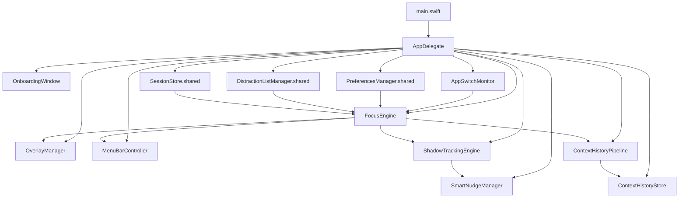
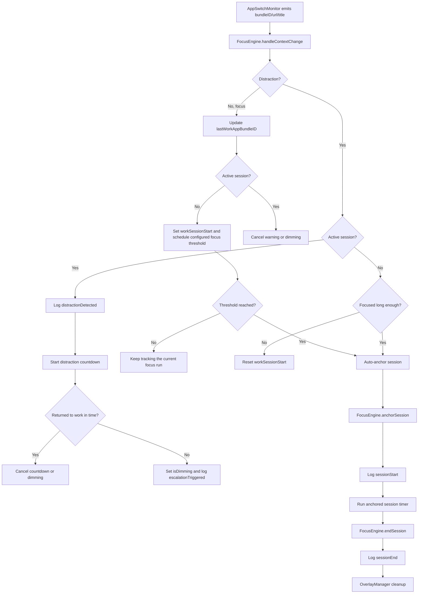

# Anchored Architecture

## Purpose

This document is the fast path for future agents and engineers. Read it before exploring the repo when you need to understand:

- how the app is composed at runtime
- where focus tracking logic lives
- where persistence and analytics live
- which invariants must not be broken
- where V2.6 is expected to land

It is intentionally opinionated and file-oriented so you do not need to search the entire repository to find the relevant seams.

## Current State Snapshot

- Product: macOS menu-bar focus app
- Language/runtime: Swift 5.7, AppKit + SwiftUI, macOS 13
- Project generation: XcodeGen via `project.yml`
- Persistence: GRDB over SQLite, with legacy JSON migration in `SessionStore`
- Main composition root: `Anchored/App/AppDelegate.swift`
- Core runtime loop: `AppSwitchMonitor -> FocusEngine -> OverlayManager/MenuBarController/SessionStore`
- Current context model: `bundleID + optional URL + title`, surfaced as `AppContext`
- Work profiles now persist per-profile `allowedApps` alongside distraction apps and domains
- Focus classification runs through `DistractionEvaluator` evidence and the central `ClassificationResolver`: explicit domains outrank explicit apps, explicit apps outrank heuristics, and unknown contexts remain neutral. FocusEngine consumes one final `ClassificationDecision`; optional local/cloud/visual evidence may only promote a still-neutral context to focus after generation checks. The menu bar exposes a safe explanation and immediate app/domain corrections, while optional interaction summaries only adjust ambiguous productive evidence within a bounded cap.
- Intent-aware tracking now compares a sanitized `FocusIntent` baseline against the current `ContextSnapshot`, and the generated intent-classifier input can include transient on-device screen text when it is safe to capture. During active sessions, high-confidence entertainment/unrelated intent can start the existing countdown grace period, but it still cannot dim immediately. Committed breaks auto-resume only after the user has left work and returned to a related context for 15 seconds.
- Commitment lock is an app-level policy guard: it forces launch-at-login and the loop breaker on, keeps both quit paths available, and now shows an explicit Unlock action in Settings instead of hiding the only escape path behind the protected controls. It adds a manual Force Dim Now command but never makes the app inescapable.
- Supported educational browser videos stay neutral unless an explicit rule or stronger intent signal says otherwise.
- Session-start and dim-return surfaces now auto-suggest a session goal plus profile/category from the current context, so a user can start or resume without typing a summary when the current window/title is clear enough.
- A persisted focus schedule gate now controls automatic focus behavior by time of day. It supports a work window plus optional lunch break, keeps manual sessions available at any time, and exposes outside-hours status in the menu bar so the app can stay quiet during lunch or after hours.
- The distraction countdown, committed-break duration, committed-break return grace, doomscroll threshold timer, automatic focus prompt timer, and active-session expiry timer now use injected `OneShotTimerScheduling` seams in `Anchored/Engine/OneShotTimerScheduler.swift`; each scheduled callback carries generation/session/context checks so stale callbacks from a prior entry or superseded candidate cannot dim, resume, auto-start, or end a break against newer state. These six paths can now be cancelled and expired deterministically in tests without wall-clock sleeps. The other engine timers still use the direct `Timer` path for now.
- `DiagnosticsCenter` now keeps a bounded in-memory buffer of sanitized operational events, and the Privacy & Data pane exposes a `Copy Diagnostic Report` action that copies app version, macOS version, permission state, migration version, enabled subsystem names, and recent safe state/timer events without persisting raw titles, URLs, OCR, typed text, screenshots, browsing history, or API keys.
- Wave 3 adds `LocalTextClassifier` behind `PreferencesManager.enableLocalTextClassification` (off by default). It receives a sanitized `ContextSnapshot` plus transient on-device visible text from OCR off-main and scores that real context entirely on-device; when enabled, high-confidence productive results may promote the current neutral context. If disabled, local text classification is skipped.
- Wave 4 constrains cloud classification to categorical `CloudClassificationInput` values and structured `ClassificationResult` responses; it never sends OCR, screenshots, raw titles, full URLs, browsing history, typed content, or raw interaction data. Visual analysis is an experimental, disabled-by-default final fallback after local text and cloud resolution, running entirely via macOS native Vision APIs (OCR and Image Classification) and completely free of expensive external python/SmolVLM subprocesses.
- The application includes privacy controls to toggle the experimental visual fallback (`PreferencesManager.enableImageClassification`) and the local on-device text check (`enableLocalTextClassification`) during onboarding and in settings; the offline classifier no longer depends on an always-on Ollama-style server.
- A private in-memory classification cache (`classificationCache`) in `FocusEngine.swift` stores and reuses classification decisions for the duration of the context (active profile/allowed rule changes clear the cache), preventing redundant executions of local text, cloud, and visual fallbacks on the same context snapshot.
- The application dynamically updates its `NSApplication` activation policy: it runs as a background-only accessory app (no Dock or Cmd+Tab app switcher icon) by default, but elevates to a regular application (showing the Dock/Cmd+Tab icon) when onboarding, settings, or focus session windows are open.
- The onboarding focus threshold and distraction countdown remain separate: focus threshold controls session establishment, countdown duration controls the warning countdown, the warning pill can be disabled from Settings, and the user can customize the screen dim level (opacity) and dim transition duration (including support for instant/poff transitions) in PreferencesManager. Music and podcast apps get a longer distraction grace window before dimming. `DimOverlayWindow` now renders a fog-like full-screen overlay, shows the mission warning text for 30% of the dim transition, and then fades it out before `OverlayManager` reveals the dim-center panel at the same 30% point.
- Automatic focus tracking now runs continuously in the normal runtime: `ShadowTrackingEngine` watches focus context on device, `FocusEngine` auto-anchors a session once the focus threshold is reached, and `SmartNudgeManager` only adds an optional local notification when auto-focus starts
- Context history now persists sanitized observations into a dedicated `context_observations` table through `ContextHistoryPipeline` and `ContextHistoryStore`
- `PreferencesManager.selectedThemeID` drives the active palette, with the default `baldr` theme now presented as the warm walnut, brass, and parchment `Heritage` palette
- `PreferencesManager.focusSchedule` persists the scheduled focus window and optional lunch break as JSON in `UserDefaults`, and `focusScheduleDidChange` tells the engine when the active window flips.
- `ThemePalette` is the shared chrome layer for appearance, with semantic canvas/surface/border/text roles now derived from each theme's own colors and contrast-aware text colors, so accents, backgrounds, layout surfaces, onboarding, overlays, custom windows, popovers, and dashboard chrome inherit the active theme
- The entire user-facing app is now unified under the dark warm control-room aesthetic with glowing background overlays, matching the dashboard, and the user-facing Appearance chooser has been removed from Settings
- Major architectural pressure in V2.6 resolved: context collection reliable/async, privacy-aware, test seams injection-based — `NSClassFromString` removed from production, replaced by `WindowTextExtracting`/`VisualProductivityChecking` providers in FocusEngine, `FreshInstallChecking` in AppDelegate, `useMockOnly` flag in KeychainHelper, session injection in CloudClassifier.
- Storage now has versioned GRDB migration path v1-v4, URL/title sanitization via `ContextSanitizer`, opt-in `context_observations` with retention/pruning/count/oldest in `ContextHistoryStore`, and explicit main-thread warnings + async wrappers in `SessionStore`/`SQLiteSessionStore`.
- Dashboard analytics primary API is async `DashboardQuerying` (fetchRangeSummary/topDistractions/earliestDate/focusTimePerHour) off-main via `performDashboardQuery` with generation-checked load states; legacy sync tuple methods deprecated with main-thread warnings. Analytics month-to-date is anchored to first session, with the all-time summary below the fold.
- `MenuBarController` routes Analytics into `SettingsWindow`; `SettingsView.swift` embeds `DashboardView.swift` without standalone sidebar; analytics, profiles, focus apps, preferences share one window.
- Settings sidebar no longer exposes separate Stats/Hourglass or Analytics/legacy reporting destinations; Analytics is the single reporting surface; Privacy & Data pane now exists with context-history controls, classification-feedback and interaction-summary opt-ins, retention/clear controls, observation count/oldest async, and Cloud AI toggle co-located.
- `Anchored/App/Views/ControlRoomSurface.swift` holds reusable shell/card/footer primitives; dashboard uses `ControlRoomShellBackground` warm dark, no pitch-black fallback; Appearance chooser removed.
- Async context pipeline fully implemented: `AppSwitchMonitor` queries `ContextCollector` off-main, AppleScript via `AppleEventExecutor` serial queue 750ms discard-late, dedup via `ContextIdentity` (bundleID+sanitizedURL+normalizedTitle), polling 2.5s, runs the timer in `RunLoop.main` common modes so tab changes remain visible while the app is accessory/background, suspends on screensDidSleep/sessionDidResignActive, resumes on screensDidWake/sessionDidBecomeActive, stops privileged polling on .permissionDenied. `FocusEngine` freezes focused-time accounting and enforcement timers while the Mac sleeps or the session locks, then shifts its in-memory clocks forward on wake/unlock. It consumes one `ContextSnapshot` atomically, notification includes snapshot, never blocks main.
- Cloud BYOK: `KeychainHelper` service `com.varun.Anchored.cloud-ai`, `kSecClassGenericPassword`, `kSecAttrAccessibleWhenUnlockedThisDeviceOnly`, internal `mockKeys` only when `useMockOnly`, and an in-memory cache that avoids repeated keychain reads after the key is loaded or saved; no UserDefaults leak. `CloudClassificationService` wraps header-only `CloudClassifier` transport (x-goog-api-key/Bearer/x-api-key) with categorical redacted input and structured output; requests run off-main, and only a productive result for the same still-neutral context may promote it to focus. Late, failed, low-confidence, or unproductive results never start dimming or override explicit rules.
- Wave 0 of the commitment and weekly-review plan froze the pure cross-module contracts in `Anchored/Models/CommitmentModels.swift` and `Anchored/Models/WeeklyReviewSummary.swift`, with threshold/calendar rules in `Anchored/Engine/CommitmentPolicy.swift`.
- Wave 1 adds `PreferencesManager.automaticSessionDuration` (25-minute default) independently from `effectiveFocusThreshold`; `ShadowTrackingEngine` remains the primary background gate, `FocusEngine` auto-anchors the tracked focus run at threshold, and `SmartNudgeManager` uses the automatic duration. Summary prompting and weekly-review delivery have independent persisted toggles, with notification permission still owned by the notification layer.
- Automatic sessions now use `AutomaticDurationRecommendation`: after five eligible completed sessions, the latest twelve successful durations are summarized by median, rounded to five minutes, and bounded to 15–90 minutes; the persisted automatic duration remains the fallback.
- Wave 2 adds the main-thread-owned break lifecycle in `FocusEngine`: accepted breaks pause focused-time accounting for two minutes, carry only an in-memory intention, and enter a generation-checked review. `ConservativeBreakReviewChecker` accepts sanitized `ContextIdentity` input; only explicit rules may route review into the existing countdown, while optional/uncertain results remain non-enforcing. The active-session popover owns Done/Break and summary prompt/edit actions. A returned work context can now auto-resume a break after a 15-second stable grace period, but only after the user has actually left work and come back.
- During countdown and dim escalation, `CountdownPillPanel` remains a separate status-level interactive surface when enabled, and Settings can hide it entirely. Escalation creates one click-through `DimOverlayWindow` only on the display containing the distraction; the window hosts the fog overlay and a 30% mission-warning phase, and `DimCenterPanel` appears only after that phase and the dim transition complete on that same display. `DimCenterView` provides a clearly bounded task field and a Close and Return to Work action: it asks for a declared task, closes the active distracting browser tab through Apple Events (or the focused app window through Accessibility as a fallback), resumes the paused focus clock, then starts the declared-activity bypass. Break requests from the overlay bypass the 30-minute minimum duration check, and the dim center overlay break button enforces a 3-second delay before it becomes clickable.
- Doomscroll Loop Breaker: `FocusEngine` tracks time spent in a distraction context **outside** any active session. When the user exceeds `PreferencesManager.doomscrollThreshold` (default 30 minutes, persisted), `FocusEngineDelegate.didDetectDoomscrolling` fires. `OverlayManager` presents a `DoomscrollBreakerPanel` (upper-right, non-activating) with three choices: Dim Screen (triggers `DimOverlayWindow` + `DimCenterPanel` in a session-less context that lifts on any action), Start Focus Session (calls `anchorSession`), or Dismiss. The doomscroll timer cancels immediately when the user switches to a focus or neutral context. `PreferencesManager` persists `enableDoomscrollLoopBreaker` (default on) and `doomscrollThreshold` (default 1800 s); both are exposed as sliders in the new "Doomscroll Loop Breaker" settings group in `GeneralSettingsPane`.


## Repo Map

### Product code

- `Anchored/App/`
  - Process entry and app composition.
  - `main.swift` starts `NSApplication`.
  - `AppDelegate.swift` wires the monitor, engine, overlay manager, menu bar, onboarding, and smart nudge pipeline.
- `Anchored/App/Views/`
  - `DashboardView.swift` composes the dashboard shell and cards.
  - `ControlRoomSurface.swift` provides the shared background/card/footer primitives for the new control-room visual language.
- `Anchored/MenuBar/`
  - Status item, popover/menu behavior, settings window, dashboard window, start-session window.
- `Anchored/Engine/`
  - Focus tracking, app/browser context collection, classification resolution, history pipeline, profile logic, nudges, URL matching.
- `Anchored/Models/`
  - Session, event, state, context, classification, dashboard, persistence, profile, and theme value types.
- `Anchored/Storage/`
  - Preferences, focus/distraction lists, GRDB store, history store, migrations, dashboard queries.
- `Anchored/Overlay/`
  - Exit trigger, countdown pill, permission gate, dimming overlays.
- `Anchored/Onboarding/`
  - First-run flow and profile/preferences onboarding UI.
- `Anchored/Audio/`
  - Sound feedback for overlay/session interactions.

### Tests

- `AnchoredTests/Engine/` covers engine state, browser parsing, URL matching, smart-nudge-adjacent logic.
- `AnchoredTests/Storage/` covers SQLite/queries/preferences/list managers.
- `AnchoredTests/Models/` covers value types and event encoding.
- `AnchoredTests/Overlay/` and `AnchoredTests/Audio/` cover UI coordinators and sound behavior.

## Runtime Composition

### Composition root

`Anchored/App/AppDelegate.swift` is the real architecture hub today.

It currently:

1. Delegates fresh-install detection to `FreshInstallChecking` (`LiveFreshInstallChecker` with `FileManager` + `appPathProvider` closure), removing `NSClassFromString` sniffing. `shouldShowOnboardingFlow` delegates to checker; tests inject `FlagOnlyChecker`.
2. On completion, instantiates:
   - `AppSwitchMonitor` (2.5s poll, sleep/wake/lock suspend/resume, ContextIdentity dedup)
   - `FocusEngine` with injected `LiveOCRProvider` (`WindowTextExtracting`), `LiveVisualProductivityChecker` (`VisualProductivityChecking`), and optional `ContextClassifying` local text runtime that can consume transient visible OCR text
   - `OverlayManager`
   - `MenuBarController`
   - `ShadowTrackingEngine`
   - `SmartNudgeManager`
   - `ContextHistoryStore.shared` with `isEnabled = prefs.contextHistoryEnabled` and `performLaunchMaintenance(retentionDays:)` from prefs
   - `ContextHistoryPipeline` listening `.focusEngineContextDidChange`
   - `ClassificationFeedbackStore.shared` with the feedback opt-in and retention maintenance wired from preferences
3. Wires `ShadowTrackingEngine` and `SmartNudgeManager` into live focus runtime; auto-focus always active, `FocusEngine` auto-anchors the tracked focus run at threshold, and nudges only gate notification.
4. Subscribes to `PreferencesManager.shared` publishers for `focusThreshold`, `countdownDuration`, `contextHistoryEnabled`, `contextHistoryRetentionDays`, and `classificationFeedbackEnabled` → mutates live engine + history/feedback stores (prune on retention change).
5. Starts `FocusEngine` which starts activity monitor.
6. History store enforcement lives in storage boundary (`ContextHistoryStore.record` checks isEnabled), not just UI.

Composition remains centralized but now has explicit test seams for onboarding, OCR, visual check, Keychain mock, and URLSession injection.

### Composition diagram



### Primary runtime flow

```text
NSWorkspace activation / polling
  -> AppSwitchMonitor
  -> FocusEngine.handleContextChange(...)
  -> state/event decisions
  -> SessionStore / NotificationCenter / FocusEngineDelegate
  -> OverlayManager + MenuBarController + ShadowTrackingEngine observers
```

### Secondary runtime flow

```text
PreferencesManager/ProfileManager/list managers
  -> NotificationCenter or Combine updates
  -> FocusEngine/MenuBarController/ShadowTrackingEngine react
```

### Session and enforcement flow



## Core Modules

### Focus tracking and enforcement

#### `Anchored/Engine/FocusEngine.swift` + seams

This is the central behavioral engine, now with explicit test seams.

Responsibilities:

- stores current app, URL, title, and `AppContext` + latest `ContextSnapshot`
- tracks `idle`, `watching`, `anchored` states
- resolves `DistractionEvaluator` evidence through `ClassificationResolver`, then coordinates state transitions from the final decision; it does not own rule precedence
- publishes the current safe `ClassificationDecision` to the menu bar and applies corrections through `ProfileManager`, recording only opt-in structured feedback
- passes an opt-in, memory-only `InteractionSummary` to the resolver; the bounded modifier cannot override explicit rules
- runs the opt-in local text classifier off-main against a sanitized snapshot plus transient visible OCR text; generation/current-context checks protect the promotion callback
- schedules the optional pipeline in order: local text, then cloud structured evidence, then the explicitly enabled visual fallback; generation checks discard stale results and only a productive result can promote the current neutral context to focus through the resolver
- uses `OneShotTimerScheduling` for the distraction countdown, committed-break duration, committed-break return grace, doomscroll threshold, focus prompt, and active-session expiry paths; `Anchored/Engine/OneShotTimerScheduler.swift` owns the live one-shot `Timer` wrapper while tests inject manual schedulers to fire or cancel the pending callbacks deterministically, and the engine tags each scheduled timer with generation plus session/context identity checks so stale callbacks are ignored even if the same bundle re-enters or a later return supersedes the first candidate
- gives music and podcast apps a longer grace window before dimming, so productive work is harder to interrupt while media playback stays open briefly
- auto-suggests the next session goal plus profile/category from the current context so the menu-bar start sheet and dim-return sheet can prefill the user-facing labels
- auto-anchors the current focus run once the focus threshold is met, using the configured automatic session duration, instead of showing the old start prompt
- builds a sanitized `FocusIntent` baseline from the session goal plus starting context, then runs an intent-relative local classifier that can keep distractions in the countdown grace path without letting them dim immediately
- exposes `forceImmediateDim()` for the manual force-dim hotkey/menu action; it logs the escalation request and hands the immediate-dim request to the overlay delegate without waiting for the countdown
- honors the persisted focus schedule gate: outside the configured window it suppresses automatic prompts, countdowns, doomscroll escalation, and shadow tracking, then restores those timers when the schedule opens again
- owns the committed-break duration timer: accepted breaks stay active for 2 minutes before entering break review, and the review callback is now generation-checked through the shared one-shot scheduler seam
- owns the committed-break return grace timer: after the user leaves work and comes back, a stable related context for 15 seconds resumes the paused session through the existing break-review resume path
- creates `sessionStart`, `distractionDetected`, `escalationTriggered`, `sessionEnd`
- drives distraction countdown and dimming
- posts `focusEngineStateDidChange` and `focusEngineContextDidChange` with snapshot

Injection seams (Task 9):

- `WindowTextExtracting` / `LiveOCRProvider`: Vision `CGWindowListCreateImage` + `VNRecognizeTextRequest` off-main, injected into FocusEngine. Tests inject `MockOCRProvider` returning configurable visible text for local text classification.
- `VisualProductivityChecking` / `LiveVisualProductivityChecker` wrapping `SmartImageClassifier.isProductiveVisual` (now without XCTest sniffing). Tests inject `MockVisualChecker` returning false.
- `OneShotTimerScheduling` / `LiveOneShotTimerScheduler`: one-shot timer seam used by the distraction countdown, committed-break duration, committed-break return grace, doomscroll threshold, focus prompt, and active-session expiry paths; production keeps the main run loop behavior while tests inject manual handles.
- `activityMonitor: ActivityMonitor`, `distractionListManager`, `sessionStore`, `profileManager`, `preferencesManager` all injected
- Cloud: `CloudClassifier(preferences:)` with optional `URLSession` injection, no `NSClassFromString` for MockURLProtocol

Important inputs:

- `ActivityMonitor` (AppSwitchMonitor → ContextCollector → AppleEventExecutor)
- `ProfileManager.activeProfile` (allowedApps/distractionApps/domains)
- `SessionStore`, `PreferencesManager` (effective thresholds, focus schedule, cloud enable)
- `ShadowTrackingEngine`

Important outputs:

- `FocusEngineDelegate` → `OverlayManager`
- session events → storage
- notifications → menu bar, nudge, history pipeline
- `ContextSnapshot` in notification userInfo for history

State invariants:

- `activeSession != nil` => `.anchored`, `workSessionStart != nil && activeSession==nil` => `.watching`
- distraction countdown/dimming only during anchored
- committed breaks resume only after a stable related work return or explicit break-review completion; simply staying on the work app after requesting a break does not auto-resume
- `lastWorkAppBundleID` last focus context reused for logging
- `currentContext` latest raw, `PersistedContextObservation` sanitized copy
- No `NSClassFromString`, no semaphore blocking main, no SQLite on main via engine
- `ClassificationResolver` is the policy owner for evidence precedence; it is independent of storage and UI, and FocusEngine is only its final-decision consumer.
- Explicit domain allow/block rules are final for a target; explicit app rules are final for an app target, and heuristics, visual checks, and cloud checks cannot reverse either explicit level.
- Async classifier results are discarded when the foreground context generation changes and can never directly initiate dimming.

Files to read:

- `Anchored/Engine/FocusEngine.swift` (session-state coordinator)
- `Anchored/Engine/FocusIntentClassifier.swift` (local intent-relative classifier)
- `Anchored/Engine/DistractionEvaluator.swift` (profile rules and conservative browser/app evidence producers)
- `Anchored/Engine/ClassificationResolver.swift` (central evidence precedence and conservative final decision)
- `Anchored/Models/ClassificationResult.swift` (`ClassificationEvidence`, `ClassificationDecision`, safe reasons, policy ranks)
- `Anchored/Models/FocusIntent.swift` (sanitized intent/baseline input and intent-relative result types)
- `Anchored/Models/ClassificationOutcome.swift` (structured persistence for context/classification history)
- `Anchored/Models/ClassificationFeedback.swift` + `Anchored/Storage/ClassificationFeedbackStore.swift` (sanitized opt-in corrections, clearable and retention-pruned)
- `Anchored/Models/InteractionSummary.swift` (memory-only idle/foreground aggregates and bounded interaction buckets)
- `Anchored/Engine/LocalTextClassifier.swift` (versioned opt-in on-device text scorer over sanitized snapshot + OCR text)
- `Anchored/App/StartSessionWindow.swift` and `Anchored/MenuBar/MenuBarPopoverView.swift` (auto-suggested session profile/goal defaults)
- `Anchored/Overlay/DimCenterView.swift`, `Anchored/Overlay/DimCenterPanel.swift`, and `Anchored/Overlay/OverlayManager.swift` (suggested return-to-work label prefill)
- `Anchored/Overlay/DimOverlayWindow.swift` (fog overlay, mission-warning phase, and dim transition host)
- `Anchored/Storage/PreferencesManager.swift` (warning pill and dim timing preferences)
- `docs/ml/local-classifier-evaluation.md` (fixture/version policy and precision gate)
- `Anchored/Engine/CloudClassificationService.swift` (cloud adapter seam)
- `Anchored/Engine/CloudClassificationFeatures.swift` + `Anchored/Engine/CloudClassifier.swift` (categorical redacted cloud contract and provider transport)
- `Anchored/App/FreshInstallChecker.swift` (new)
- `Anchored/Engine/ShadowTrackingEngine.swift`
- `Anchored/Engine/SmartNudgeManager.swift`
- `AnchoredTests/Engine/FocusEngineTests.swift` (mocks for OCR/visual)
- `AnchoredTests/Engine/IntentAwareFocusEngineTests.swift` (intent-aware grace and stale-result coverage)
- `AnchoredTests/Storage/ClassificationOutcomeStoreTests.swift` (sanitized opt-in tracking persistence)

### Context collection

#### `Anchored/Engine/AppSwitchMonitor.swift`

Current role:

- observes `NSWorkspace.didActivateApplicationNotification`
- identifies the frontmost app bundle ID
- triggers asynchronous context queries via `ContextCollector`
- emits `ContextSnapshot` through `onContextChange` when a context shift is detected
- deduplicates incoming context changes using `ContextIdentity`

Current constraints:

- browser polling remains timer-based (2.5 seconds) but is fully asynchronous and uses common run-loop modes so browser tab changes keep flowing while Anchored is backgrounded/accessory
- non-browser apps only query native Accessibility context providers
- timer suspending, locking, and system wake operations suspend active collection requests correctly

#### `Anchored/Engine/BrowserStrategies.swift`

Contains:

- `ChromiumBrowserStrategy`
- `SafariBrowserStrategy`
- `FirefoxBrowserStrategy`
- `BrowserStrategyFactory`

Current architectural observations:

- browser context retrieval is asynchronous and non-blocking using `AppleEventExecutor`
- failure returns typed errors mapped to result completions
- Safari fallback Javascript checks remain intact

New helper seams that support the V2.6 provider work:

- `Anchored/Engine/AccessibilityValue.swift`
- `Anchored/Engine/AccessibilityContextProvider.swift`
- `Anchored/Engine/AppleEventExecutor.swift`
- `Anchored/Engine/ContextCollector.swift`
- `Anchored/Engine/ContextHistoryPipeline.swift`
- `Anchored/Storage/ContextHistoryStore.swift`
- `Anchored/Models/PersistedContextObservation.swift`
- `Anchored/Models/DashboardModels.swift`

The V2.6 async context collection pipeline is fully integrated with safe accessibility helpers, serial background queues, and request generation checking.

#### `Anchored/Engine/ContextSanitizer.swift`

Pure sanitizer for persisted titles and HTTP(S) URLs.

Responsibilities:

- collapses whitespace and control noise in persisted titles without lowercasing
- caps persisted titles at 512 grapheme clusters
- strips credentials, query, and fragment from persisted URLs
- rejects unsupported schemes rather than partially sanitizing them

#### `Anchored/Storage/DatabaseMigrations.swift`

Versioned GRDB migration plan used by `SQLiteSessionStore`.

Responsibilities:

- creates the `sessions` schema and indexes when absent
- creates the `context_observations` table and its timestamp index
- sanitizes legacy `sessions.url` values in place
- keeps migration behavior idempotent

### Persistence and analytics

#### `Anchored/Storage/SessionStore.swift`

Facade, not real query layer, now with async wrappers + main-thread warnings.

Responsibilities:

- owns migration from legacy `sessions.json`
- forwards writes/reads to `SQLiteSessionStore`
- preserves convenience `log` API with completion
- computes stats via in-memory reads, but now via static `computeStats`/`computeBreakdown` off-main helpers
- warns if `recentSessions`/`allEvents`/`getStats`/`getAppBreakdown` called on main, offers `fetchRecentSessions`/`fetchAllEvents`/`fetchStats`/`fetchAppBreakdown` async variants

Architectural note: class name suggests main store, but durable storage is SQLiteSessionStore; analytics split between here and DashboardQueries.

#### `Anchored/Storage/SQLiteSessionStore.swift`

Real persistence boundary, hardened for V2.6 + BYOK.

Responsibilities:

- owns GRDB `DatabaseQueue`, applies versioned migrations v1-v4 from `DatabaseMigrations.swift` (sessions idx, context_observations, metadata, sanitize legacy URLs transactionally idempotent)
- creates/migrates `sessions` + `context_observations` tables
- writes on utility queue, completion on main, preserves original DB on migration failure with `migrationError`
- exposes count/oldest/prune/clear/latest identity for history store
- now warns if `recentSessions`/`allEvents` called on main, provides async variants
- `DatabaseMigrations` kept in `SQLiteSessionStore.swift` OR `DatabaseMigrations.swift` per repo invariant

Current schema `sessions`: id, timestamp, type, appBundleID, appName, url (sanitized), focusDurationSeconds, sessionDurationSeconds, distractionAppBundleID, distraction_domain, action, category, sessionGoal. `context_observations`: bundleID, appName, title, url, source, domain, sessionState, observedAt, etc., sanitized.

SQL ownership invariant: keep SQL in `SQLiteSessionStore.swift` or `DashboardQueries.swift` only.
Sanitization invariant: `SessionEvent.persistedCopy()` + `ContextSanitizer` strip creds/queries/fragments, cap titles 512 graphemes.

#### `Anchored/Storage/DashboardQueries.swift`

Analytics/query extension layer on top of `SQLiteSessionStore`, now async-first.

Responsibilities:

- total focus time, daily timeline, top distractions, streak, app name lookup, chart-friendly buckets
- Primary API: async `fetchRangeSummary`, `fetchTopDistractions`, `fetchEarliestSessionDate`, `fetchFocusTimePerHourForLast24Hours`, `fetchFocusTimePerDay`, `fetchAppDomainFocusDistribution` via `performDashboardQuery` on `global(qos:.userInitiated)` → main completion, generation-checked per view
- Legacy sync tuple methods deprecated with `warnIfMainThread` warnings, now private compute helpers (`computeTodayTotalFocusTime`, etc.) without nested queue.sync
- `DashboardDataModel.refresh` generation-guarded, chains earliestDate → parallel range summaries + top distractions + hourly/daily, discarding stale generations
- `TopDistractionsPanel` shows `Loadable` loading/error/empty states, `TidalWaveChartView` already had Loadable + requestGeneration

This file reconstructs analytics from event streams, never SQLite on main in new API.

#### `Anchored/Storage/ContextHistoryStore.swift`

Dedicated store facade for privacy-reviewed context observations.

Responsibilities:

- accepts raw context tuples from the live monitor path
- sanitizes and deduplicates consecutive identical observations before persistence
- keeps history writes off the main thread and calls completions back on the main queue
- supports count, oldest-date, prune, and clear operations for privacy/history settings

#### `Anchored/Engine/ContextHistoryPipeline.swift`

Bridge from `FocusEngine` context-change notifications into the history store.

Responsibilities:

- listens for `.focusEngineContextDidChange`
- converts the current focus context into a persisted observation
- maps browser bundle IDs to source labels for history rows
- keeps the history seam off until the store is explicitly enabled

### Preferences and classification inputs

#### `Anchored/Storage/PreferencesManager.swift`

Owns:

- countdown duration
- focus threshold
- launch at login
- smart nudges enablement
- warning pill visibility
- commitment lock state
- legacy focus-start rollout state
- selected settings theme
- persisted focus schedule gate with work-window and lunch-break settings
- AI Visual Productivity Check (`enableImageClassification`)
- SmolVLM 256M VLM model toggle (`useLocalGemma`) and download status (`gemmaDownloadStatus`)
- Cloud AI Productivity Check (`enableCloudClassification`), provider, model, and endpoint settings

Architecture notes:

- `@Published` state is live-wired into the engine from `AppDelegate`
- launch-at-login behavior is abstracted behind `LoginItemService` for tests
- theme selection persists through `UserDefaults` and resolves through `ThemeCatalog`
- a hidden `focusThresholdOverride` defaults key can temporarily shorten the live engine threshold without changing the persisted picker value
- when commitment lock is enabled, `launchAtLogin` and `enableDoomscrollLoopBreaker` are forced back on, both app quit paths remain available as an emergency escape, and Settings shows an explicit Unlock action for the lock itself
- `focusPromptExperimentEnabled` is retained as a legacy rollout preference, but the shipped runtime no longer branches on it
- `focusScheduleDidChange` tells the live engine when the configured schedule moves between active and inactive windows
- `showCountdownPill` controls whether the warning pill appears before dimming; dimming still runs and the dim-center panel still appears on schedule

#### `Anchored/Models/AppTheme.swift`

Defines the reusable settings theme catalog.

Responsibilities:

- stores named palettes with primary and secondary gradients
- exposes the active theme lookup by identifier
- keeps palette colors centralized for settings UI styling
- centralizes semantic canvas, surface, border, separator, and text roles for app chrome

`ThemeCatalog` currently supplies the Odin, Thor, Loki, Heimdall, Freyja, Baldr, and Tyr themes.

#### `Anchored/Storage/InstalledAppSuggestionProvider.swift`

Scans installed applications for suggestions used by profile configuration. It owns no global focus-app state; profiles remain the only app allowlist.

Important behavior:

- scans installed applications, categorizes them (Coding, Video, Writing, Distractions), and seeds them dynamically to their respective default profiles on first run or via a one-time migration
- tests special-case `XCTest` so focus behavior defaults differently under test

This special test branch matters when debugging classification behavior.

#### `Anchored/Storage/DistractionListManager.swift`

Owns distraction bundle IDs in `UserDefaults` and can scan installed apps for likely distractions.

#### `Anchored/Engine/ProfileManager.swift`

Owns multiple `WorkProfile` definitions:

- distraction apps
- distraction domains
- allowed apps
- allowed domains

The built-in Coding profile seeds a small allowed-app list for obvious productive tools; the other defaults remain conservative.

Behavioral invariant:

- app-level allow lists override app-level distraction lists
- URL/domain distraction matches still win when a URL is present
- profile switches emit notifications that can immediately change current engine behavior

### UI coordinators

#### `Anchored/Overlay/OverlayManager.swift`

This is the enforcement UI coordinator via `FocusEngineDelegate`.

It shows:

- exit-trigger panel
- distraction countdown pill, when enabled
- permission gate
- dimming overlays

Important invariant:

- UI enforcement is delegated out of `FocusEngine`; engine owns state, overlay manager owns windows/panels
- the countdown pill is optional, `OverlayManager` now sequences a mission-warning phase inside the fog overlay that lasts 30% of the dim transition before revealing the dim-center panel, the dim-center reveal is aligned to that 30% point, and the dim overlay remains click-through while the fog visual ramps up

#### `Anchored/MenuBar/MenuBarController.swift`

Owns:

- status item/menu lifecycle
- settings window entry points, including Analytics
- start/end session actions
- the manual Force Dim Now action and the locked quit presentation
- current stats display

It depends on:

- `FocusEngine`
- `SessionStore`
- `ProfileManager.shared`

#### `Anchored/App/Views/DashboardView.swift`

Own:

- the Analytics surface embedded in settings
- the optional standalone sidebar, range selector, trend chart, distraction list, focus score, month-to-date summary cards, and all-time summary card
- local data loading for focus trends, top distractions, range summaries, and all-time summaries via `MenuBarViewModel`, `DashboardQuerying`, and `SQLiteSessionStore`

They depend on:

- `FocusEngine`
- `MenuBarViewModel`
- `PreferencesManager.shared`
- `SQLiteSessionStore.shared`

#### `Anchored/MenuBar/SettingsView.swift`

Owns the settings split view and the embedded Analytics surface.

Responsibilities:

- routes General, Focus Apps, Analytics, About, and profile configuration
- injects the live `FocusEngine` into the Analytics view
- applies the warm wood/brass theme colors to settings chrome, cards, and pane backgrounds
- exposes focus schedule controls in General for enabled/disabled, start/end time, and optional lunch break windows
- exposes the commitment lock control and shows an explicit Unlock action when the lock is on, while visually disabling the dependent launch-at-login and loop-breaker controls
- keeps profile configuration in direct language rather than former themed terminology
- uses one Analytics destination instead of separate Stats/Hourglass and legacy reporting panes
- keeps Analytics inside the settings window rather than opening a separate analytics window

Other appearance surfaces now reuse the shared theme palette directly:

- `Anchored/MenuBar/MenuBarPopoverView.swift`
- `Anchored/App/StartSessionWindow.swift`
- `Anchored/Onboarding/OnboardingStyles.swift`
- `Anchored/Overlay/PermissionGateView.swift`
- `Anchored/Overlay/ExitTriggerView.swift`
- `Anchored/Overlay/EndSessionButton.swift`
- `Anchored/Overlay/CountdownPillView.swift`
- `Anchored/Overlay/DimOverlayWindow.swift`
- `Anchored/App/Views/TopDistractionsView.swift`
- `Anchored/App/Views/WeeklyHistoryView.swift`
- `Anchored/App/Views/ConstellationHeatmapView.swift`
- `Anchored/App/Views/FleetTreeSpreadmapView.swift`
- `Anchored/App/Views/TidalWaveChartView.swift`
- `Anchored/Overlay/EndSessionButton.swift`
- `Anchored/Overlay/CountdownPillView.swift`
- `Anchored/Overlay/DimOverlayWindow.swift`
- `Anchored/App/Views/TopDistractionsView.swift`
- `Anchored/App/Views/WeeklyHistoryView.swift`
- `Anchored/App/Views/ConstellationHeatmapView.swift`
- `Anchored/App/Views/FleetTreeSpreadmapView.swift`
- `Anchored/App/Views/TidalWaveChartView.swift`

### Shadow tracking and smart nudges

#### `Anchored/Engine/ShadowTrackingEngine.swift`

Tracks continuous focus-context time outside anchored sessions and pauses for sleep/non-focus states. `FocusEngine` applies the same sleep/lock treatment to anchored-session and automatic-start accounting, so inactive wall time cannot be counted as focused work.

Its threshold initializes from `PreferencesManager.effectiveFocusThreshold`; it no longer owns a hard-coded five-minute runtime threshold.
It also stops shadow accumulation when the focus schedule is outside its active window.

#### `Anchored/Engine/SmartNudgeManager.swift`

Auto-anchors a session after the onboarding-selected shadow threshold and sends a local notification only when smart nudges are enabled.

Architectural note:

- this path currently calls `focusEngine.anchorSession(...)` directly
- the manager also reaches into `ProfileManager.shared`

## Notifications And Cross-Module Coupling

Current cross-cutting notifications:

- `focusEngineStateDidChange`
- `focusEngineContextDidChange`
- `activeProfileDidChange`
- `profilesDidChange`
- `focusListDidChange`
- `distractionListDidChange`
- `focusScheduleDidChange`

Current coupling style:

- AppDelegate composition
- singleton managers
- NotificationCenter fan-out
- direct delegate for overlay enforcement
- direct `Timer` usage in engine/monitor/nudge flows

This is functional but makes deterministic testing and async context collection harder than necessary. V2.6 addresses part of that.

## High-Value Invariants

These come from both the code and repo rules. Future changes should preserve them unless a plan explicitly replaces them.

- `FocusEngine` state transitions are architectural invariants; no `NSClassFromString` in production, no semaphore blocking main, no SQLite on main.
- Auto-focus and shadow tracking stay on device; `ShadowTrackingEngine` and the threshold timer can start sessions, while `SmartNudgeManager` only adds notification side effects.
- The persisted focus schedule gate only controls automatic behavior; it should quiet the app outside the configured window without removing manual session affordances.
- Browser support registered through `BrowserStrategyFactory`; AppleEventExecutor serial queue 750ms discard-late.
- SQL belongs in `SQLiteSessionStore.swift` or `DashboardQueries.swift` only.
- `PersistedContextObservation` and `SessionEvent.persistedCopy()` sanitize URLs (creds/queries/fragments stripped, titles collapsed/capped) before persistence.
- History pipeline opt-in, disabled until privacy/settings enables, enforced inside `ContextHistoryStore` boundary, not just UI.
- AppKit/UI mutations on main, persistence off-main, dashboard queries async via `performDashboardQuery` + generation per view.
- Sensitive titles/URLs local, no raw logging, cloud prompt text-only sanitized, keys header-only, never logged.
- Accessibility permission loss degrades gracefully, stops privileged polling on `.permissionDenied`, suspend/resume on sleep/wake/lock/unlock, never crash.
- Sleep and a locked user session freeze focus duration, break duration, and enforcement countdowns; wake/unlock resumes only the remaining active time.
- Profile `allowedApps`/allowedDomains are explicit positive focus signals; domain rules outrank app rules, and unknown native/browser contexts remain neutral rather than starting focus tracking.
- Classification corrections add an explicit app/domain rule immediately and remove the opposite rule for the same target; invalid domain corrections are rejected.
- Classification feedback is disabled by default and never stores titles, full URLs, OCR, screenshots, typed text, coordinates, or raw interaction events. Interaction summaries are disabled by default, use only bounded in-memory aggregates, and are never persisted.
- Local text classification is disabled by default, runs off-main, reads only the sanitized snapshot identity, and cannot enforce distraction. If disabled via `PreferencesManager.enableLocalTextClassification`, it is skipped entirely. Low-confidence/conflicting results remain neutral; only a high-confidence productive result can enter the existing neutral-only promotion path.
- Cloud classification sends only categorical app/domain/title features and browser source; structured low-confidence, distracting, failed, or timed-out results remain neutral/non-enforcing. Visual classification is disabled by default, runs only after local/cloud resolution remains neutral, and promotes to focus if productive; distracting results remain non-enforcing. Sensitive contexts (keychain/password managers or containing keywords like bank, finance, login, security, etc.) skip visual classification entirely to protect user privacy and avoid false positives.
- The `classificationCache` in `FocusEngine.swift` is an in-memory dictionary that caches classification decisions by context identity. It is invalidated on active profile change and rules changes, preventing duplicate async evaluations.
- Fog/dimming uses `distractionCountdownThreshold`; automatic focus start and shadow tracking use `focusThreshold`; warning-pill visibility is a separate UI preference and not conflated with enforcement timing.
- Returning to the current confirmed work context cancels the distraction timer before dimming; queued timer callbacks are ignored when the user is back in the work app. The Accessibility permission gate is deferred until at least ten completed sessions and is not shown after every session.
- Onboarding and permission-gate copy route through `LanguageManager`; normal language is the default, pirate styling only appears when the user explicitly enables pirate mode, and onboarding views observe the shared language state so live language changes update visible copy consistently.
- Settings search stays in the detail pane of the split view instead of replacing the whole window with a narrow centered column. Search indexes individual settings with destination and scroll targets, and selecting a result navigates to the target pane while preserving the sidebar selection for when the query clears.
- Commitment lock never disables `Quit Anchored` in either the status-item menu or the application menu, and `applicationShouldTerminate` always permits termination so a permission panel or dim overlay cannot trap the user.
- The onboarding permission step also exposes a visible `Quit Anchored` action so users can quit, grant Screen Recording or Accessibility in System Settings, and reopen without relying on a menu-bar path.
- `DimOverlayWindow` remains click-through and never captures input, even while the fog treatment and mission-warning phase are active.
- The automatic focus start gate uses `PreferencesManager.effectiveFocusThreshold`, while automatic sessions use `PreferencesManager.automaticSessionDuration` (default 25 minutes). `focusThresholdOverride` affects only the gate and never the anchored session duration.
- User-authored session summaries are local-only, normalized for control characters, capped at `CommitmentPolicy.maximumSessionSummaryLength`, and stored only in `sessions.sessionSummary`; empty or oversized values are omitted. Summary edit/clear helpers live at the SQLite boundary.
- Commitment policy refuses Break before 30 minutes of net focus unless bypassed (e.g. via overlay buttons), permits a two-minute memory-only break at or after that threshold, permits Done at any active-session duration, and schedules weekly review delivery for Sunday at 8:00 AM local time. Break review identities include the session and context generation so stale results can be discarded.
- Weekly review aggregates contain counts and durations only; written summaries and break intentions are not included in notifications, cloud inputs, screenshots, OCR, context history, or logs.
- Keychain service `com.varun.Anchored.cloud-ai`, `kSecClassGenericPassword`, `kSecAttrAccessibleWhenUnlockedThisDeviceOnly`, mockKeys only when `useMockOnly`, in-memory cache after first load/save, no UserDefaults leak.
- No production code probes `XCTestCase` or `MockURLProtocol` via `NSClassFromString`; dependency injection via protocols/closures/URLSession param.
- Polling cadence 2.5s, ContextIdentity dedup (bundleID+sanitizedURL+normalizedTitle), one collection at a time, stale generation rejection.
- `SmartImageClassifier` runs entirely via local Vision APIs (OCR and Image Classification) and does not spawn any python subprocesses or load external local Gemma/SmolVLM model files.
- `InstalledAppSuggestionProvider`, `DistractionListManager`, and `SmartAppClassifier` cache filesystem and plist operations thread-safely to prevent blocking the main thread.

## Current Weak Spots

- `FocusEngine` owns significant timer/state logic; now has an injected distraction-countdown timer seam plus `WindowTextExtracting`/`VisualProductivityChecking` and `PreferencesManager`/`ProfileManager`, but still singleton-heavy via `ProfileManager.activeProfile` and `NSWorkspace.shared` direct calls in some classifiers.
- `SessionStore` vs `SQLiteSessionStore` split not obvious from names; now both have async wrappers + main warnings, but legacy sync wrappers still exist for compatibility.
- `AppDelegate` is composition root with many singletons; now wired with `FreshInstallChecking`, `ContextHistoryStore.shared`, prefs publishers for history enable/retention, but `DistractionListManager.shared` and `ProfileManager.shared` still global.
- `DashboardWindow.swift` still compiles for compat but not opened by `MenuBarController`.
- `PreferencesManager.focusPromptExperimentEnabled` legacy rollout pref.
- The new fog treatment, mission-warning phase, and delayed dim-center reveal are timing-sensitive and should still be smoke-tested in the installed app after overlay changes.
- `InstalledAppSuggestionProvider` and `DistractionListManager` cache application scans to avoid synchronous filesystem traversal on opening Settings.
- Remaining singleton mutation in tests: `KeychainHelper.mockKeys` and `KeychainHelper` in-memory cache are global, `UserDefaults` suite isolated but `NSWorkspace.shared` still real in visual checker unless mocked.
- Dashboard `TopDistractionsView`/`WeeklyHistoryView` stateless; parent panels now handle Loadable but could still use direct `SessionStore.shared` in some previews.
- `FocusEngine` remains responsible for the session timer, committed-break duration timer, focus prompt timer, declared-activity timer, break-return grace, doomscroll timer, session logging, and overlay delegate calls; the distraction countdown, committed-break duration, focus prompt, break-return grace, doomscroll timer, and active-session expiry now have scheduler seams, but `SessionTimerCoordinator` and `SessionEventRecorder` are still future extractions. The `ContextClassifying`/`ClassificationResult` on-device ML seam remains separate from the active visual provider.
- The new fog treatment, mission-warning phase, and delayed dim-center reveal are timing-sensitive and should still be smoke-tested in the installed app after overlay changes.
- The doomscroll loop breaker is still threshold-based and broad; the 30-minute default is less aggressive, but long-form video and music tabs should keep getting smoke-tested because the policy is intentionally heuristic.
- The permission milestone and commitment-lock escape paths are safety-sensitive; test the pre-dim return-to-work flow, the ten-session threshold, and quitting while the permission gate is visible.
- Deterministic evidence is now resolved centrally, but `SmartAppClassifier` still performs some synchronous workspace/plist inspection and should remain a future non-blocking seam.

## V2.6 Impact Surface

Read this section before implementing anything from `/private/tmp/anchored-plans-external/anchored-v2.6-plan.md`.

### Planned architectural additions — status 2026-07-12 (P0-P1 hardened, Wave 4 complete, tests 203 green)

V2.6 core pipeline + BYOK + privacy + dashboard async all landed and hardened:

- `ContextSnapshot` + `ContextIdentity` + `ContextCollector` + `AppleEventExecutor` (serial queue 750ms discard-late) + safe AX provider `AccessibilityContextProvider`/`AccessibilityValue` ✅
- Generation stale-rejection in collector + AppSwitchMonitor dual-suspend flags (sleep/wake/lock/unlock) ✅, polling 2.5s, ContextIdentity dedup ✅
- `ContextSanitizer` pure, `DatabaseMigrations` v1-v4 transactional idempotent ✅
- `ContextHistoryStore`/`Pipeline`/`PersistedContextObservation` opt-in, count/oldest/prune/clear, retention 1/7/30/90/365, enforced in storage boundary ✅ wired to prefs in AppDelegate
- `ClassificationOutcomeStore`/`ClassificationOutcome` opt-in, deduped, sanitized tracking of structured classification history and corrections ✅
- Privacy & Data pane `PrivacySettingsPane` in Settings: history toggle, retention picker, async count/oldest display, clear-all, Cloud AI toggle, and `Copy Diagnostic Report` action co-located ✅
- Dashboard async: `DashboardQueries` primary async `fetchRangeSummary`/`fetchTopDistractions`/`fetchEarliest...` via `performDashboardQuery` off-main, sync deprecated with main warnings, `DashboardDataModel` generation-guarded, `TopDistractionsPanel` + `TidalWaveChartView` Loadable states ✅
- `ControlRoomSurface` shell/card/footer primitives, warm dark control-room unified, Appearance chooser removed ✅
- FocusEngine: `WindowTextExtracting`/`LiveOCRProvider`, `VisualProductivityChecking`/`LiveVisualProductivityChecker`, no `NSClassFromString`, no semaphore, ordered local/cloud/visual fallback pipeline, no OCR in cloud requests, only productive neutral-context promotion, break-return grace that auto-resumes after a stable related work return, and privacy-safe diagnostics events for state transitions, timers, workspace changes, permissions, and sanitized classification outcomes ✅
- Intent-aware runtime: `FocusIntent`/`FocusIntentClassifier` keep task-intent comparison local and sanitized; high-confidence entertainment/unrelated results can enter the existing countdown grace path but never dim immediately ✅
- AppDelegate: `FreshInstallChecking`/`LiveFreshInstallChecker` with FileManager + appPathProvider injection, no XCTest sniffing ✅
- `Anchored/Engine/DiagnosticsCenter.swift` owns the bounded in-memory diagnostics buffer, sanitized report formatting, and clipboard copy helper used by Settings and FocusEngine diagnostics hooks ✅
- Keychain: service `com.varun.Anchored.cloud-ai`, `kSecClassGenericPassword`, `kSecAttrAccessibleWhenUnlockedThisDeviceOnly`, internal mockKeys only when useMockOnly, in-memory cache to avoid repeated reads, no UserDefaults leak, no key logging ✅
- CloudClassifier: categorical redacted input, structured evidence output, header-only keys (x-goog-api-key/Bearer/x-api-key), 2s ephemeral timeout, session injection, no `NSClassFromString` for MockURLProtocol ✅
- Settings: Cloud AI panel SecureField, Keychain persist, model/endpoint fields, provider picker 0 Gemini 1 OpenAI 2 Anthropic defaults gemini-2.5-flash/gpt-4o-mini/claude-3-5-haiku ✅

Remaining V2.6 follow-ups: Task 10 full singleton-free test isolation (remove all Thread.sleep fixed waits), Task 23-27 overlay/onboarding final chrome alignment, Task 36 release matrix + soak test (diagnostics buffer/report already shipped; keep no raw title/URL logs).

### ML readiness and rollout

`/private/tmp/anchored-plans-external/anchored-ml-engine-plan.md` is the focused execution plan for the future on-device classifier. It requires:

- completing the `ContextSnapshot` runtime path before CoreML integration
- keeping classification behind a `ContextClassifying` protocol and outside `FocusEngine`
- preserving explicit profile rules over ML output
- validating the model in shadow mode before predictions can affect enforcement
- using neutral fallback for low-confidence, stale, timed-out, or failed predictions

`Anchored/Engine/ContextClassifying.swift` and `Anchored/Models/ClassificationResult.swift` define the classifier result contract. Waves 1-4 wire deterministic producers, safe explanations/corrections, opt-in sanitized feedback, bounded local interaction summaries, the versioned local text runtime, and the redacted cloud/experimental visual stages through `ClassificationEvidence`, `ClassificationDecision`, and `ClassificationResolver`. Optional stages remain neutral-only and trained artifacts remain blocked until they pass the documented precision and resource thresholds.

### Files most likely to change

- `Anchored/Engine/AppSwitchMonitor.swift`
- `Anchored/Engine/BrowserStrategies.swift`
- `Anchored/Engine/AccessibilityValue.swift`
- `Anchored/Engine/AccessibilityContextProvider.swift`
- `Anchored/Engine/ContextSanitizer.swift`
- `Anchored/Engine/FocusEngine.swift`
- `Anchored/Engine/FocusIntentClassifier.swift`
- `Anchored/Engine/ClassificationResolver.swift`
- `Anchored/App/StartSessionWindow.swift`
- `Anchored/MenuBar/MenuBarPopoverView.swift`
- `Anchored/Overlay/DimCenterView.swift`
- `Anchored/Storage/InstalledAppSuggestionProvider.swift`
- `Anchored/Models/AppTheme.swift`
- `Anchored/Models/FocusIntent.swift`
- `Anchored/Models/DashboardModels.swift`
- `Anchored/Models/` for new context types
- `Anchored/Storage/SQLiteSessionStore.swift`
- `Anchored/Storage/ClassificationOutcomeStore.swift`
- `Anchored/Storage/ContextHistoryStore.swift`
- `Anchored/Storage/DatabaseMigrations.swift`
- `Anchored/Storage/DashboardQueries.swift`
- `Anchored/App/Views/TidalWaveChartView.swift`
- `Anchored/App/Views/ConstellationHeatmapView.swift`
- `Anchored/App/Views/FleetTreeSpreadmapView.swift`
- `Anchored/App/Views/TopDistractionsView.swift`
- `Anchored/App/Views/WeeklyHistoryView.swift`
- `Anchored/App/Views/ControlRoomSurface.swift`
- `Anchored/MenuBar/SettingsView.swift`
- `Anchored/MenuBar/MenuBarPopoverView.swift`
- `Anchored/App/StartSessionWindow.swift`
- `Anchored/Onboarding/OnboardingStyles.swift`
- `Anchored/Overlay/PermissionGateView.swift`
- `Anchored/Overlay/ExitTriggerView.swift`
- `Anchored/Overlay/EndSessionButton.swift`
- `Anchored/Overlay/CountdownPillView.swift`
- `Anchored/Overlay/OverlayManager.swift`
- `Anchored/Overlay/DimOverlayWindow.swift`
- `Anchored/Storage/PreferencesManager.swift`
- `AnchoredTests/Engine/`
- `AnchoredTests/Storage/`

### Expected seam changes

- context collection is handled via `ContextCollector` (asynchronous pipeline using serial background queues).
- `AppSwitchMonitor` publishes deduplicated `ContextSnapshot` values rather than raw tuples.
- `ContextHistoryPipeline` records `ContextSnapshot` details into sanitized context observations.
- Unit tests are isolated, deterministic, and avoid arbitrary sleeps.

## Where To Start By Task Type

### If you are changing focus/session behavior

Read:

- `docs/architecture/anchored-architecture.md`
- `Anchored/Engine/FocusEngine.swift`
- `Anchored/Engine/FocusIntentClassifier.swift`
- `Anchored/Engine/OneShotTimerScheduler.swift`
- `Anchored/Models/FocusIntent.swift`
- `Anchored/Engine/ShadowTrackingEngine.swift`
- `Anchored/Storage/InstalledAppSuggestionProvider.swift`
- `Anchored/Storage/PreferencesManager.swift`
- `Anchored/Storage/ClassificationOutcomeStore.swift`
- `AnchoredTests/Engine/FocusEngineTests.swift`
- `AnchoredTests/Engine/IntentAwareFocusEngineTests.swift`
- `AnchoredTests/Engine/ShadowTrackingEngineTests.swift`
- `Anchored/Overlay/OverlayManager.swift`
- `Anchored/Overlay/DimOverlayWindow.swift`

If you are working on ML-backed focus decisions specifically, also read:

- `Anchored/Engine/ContextClassifying.swift`
- `Anchored/Models/ClassificationResult.swift`

### If you are changing browser or app context collection

Read:

- `docs/architecture/anchored-architecture.md`
- `/private/tmp/anchored-plans-external/anchored-v2.6-plan.md`
- `Anchored/Engine/AppSwitchMonitor.swift`
- `Anchored/Engine/BrowserStrategies.swift`
- `Anchored/Engine/AccessibilityValue.swift`
- `Anchored/Engine/AccessibilityContextProvider.swift`
- `AnchoredTests/Engine/BrowserStrategiesTests.swift`

### If you are changing persistence or analytics

Read:

- `docs/architecture/anchored-architecture.md`
- `Anchored/Storage/SessionStore.swift`
- `Anchored/Storage/SQLiteSessionStore.swift`
- `Anchored/Storage/DatabaseMigrations.swift`
- `Anchored/Storage/ContextHistoryStore.swift`
- `Anchored/Engine/ContextSanitizer.swift`
- `Anchored/Models/PersistedContextObservation.swift`
- `Anchored/Models/DashboardModels.swift`
- `Anchored/Storage/DashboardQueries.swift`
- `Anchored/App/Views/TidalWaveChartView.swift`
- `Anchored/App/Views/ConstellationHeatmapView.swift`
- `Anchored/App/Views/FleetTreeSpreadmapView.swift`
- `AnchoredTests/Storage/`

### If you are changing settings, profiles, or list behavior

Read:

- `docs/architecture/anchored-architecture.md`
- `Anchored/Models/WorkProfile.swift`
- `Anchored/Storage/PreferencesManager.swift`
- `Anchored/Storage/InstalledAppSuggestionProvider.swift`
- `Anchored/Storage/DistractionListManager.swift`
- `Anchored/Engine/ProfileManager.swift`

### If you are changing Analytics or reporting chrome

Read:

- `docs/architecture/anchored-architecture.md`
- `Anchored/MenuBar/MenuBarController.swift`
- `Anchored/MenuBar/SettingsView.swift`
- `Anchored/MenuBar/SettingsWindow.swift`
- `Anchored/App/Views/ControlRoomSurface.swift`
- `Anchored/App/Views/DashboardView.swift`
- `Anchored/MenuBar/MenuBarViewModel.swift`
- `Anchored/Storage/SessionStore.swift`
- `Anchored/Storage/SQLiteSessionStore.swift`
- `Anchored/Storage/DashboardQueries.swift`

### If you are changing appearance or theme chrome

Read:

- `docs/architecture/anchored-architecture.md`
- `Anchored/Models/AppTheme.swift`
- `Anchored/Storage/PreferencesManager.swift`
- `Anchored/MenuBar/SettingsView.swift`
- `Anchored/MenuBar/SettingsWindow.swift`
- `Anchored/MenuBar/MenuBarPopoverView.swift`
- `Anchored/App/StartSessionWindow.swift`
- `Anchored/Onboarding/OnboardingStyles.swift`
- `Anchored/Onboarding/OnboardingWindow.swift`
- `Anchored/Overlay/PermissionGateView.swift`
- `Anchored/Overlay/ExitTriggerView.swift`

### If you are changing onboarding, menu bar, or overlays

Read:

- `docs/architecture/anchored-architecture.md`
- `Anchored/App/AppDelegate.swift`
- `Anchored/MenuBar/`
- `Anchored/Onboarding/`
- `Anchored/Overlay/`

## Maintenance Rules For This Doc

Update this doc whenever a major update changes any of the following:

- composition root or dependency wiring
- engine state model or event flow
- context collection architecture
- persistence schema or ownership
- privacy/permission handling
- analytics query boundaries
- major new modules or renamed files
- plan assumptions for V2.6

When updating it:

- describe shipped reality, not intended future state
- keep the “Current State Snapshot” accurate
- update “V2.6 Impact Surface” when plan assumptions change
- add file paths for new architectural seams
- remove stale guidance instead of only appending
